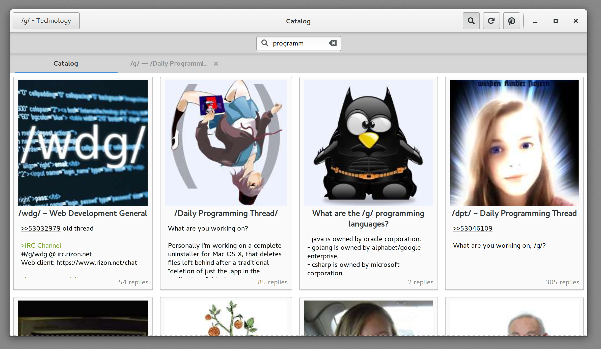
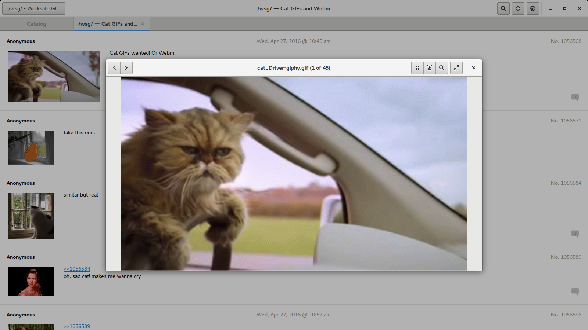
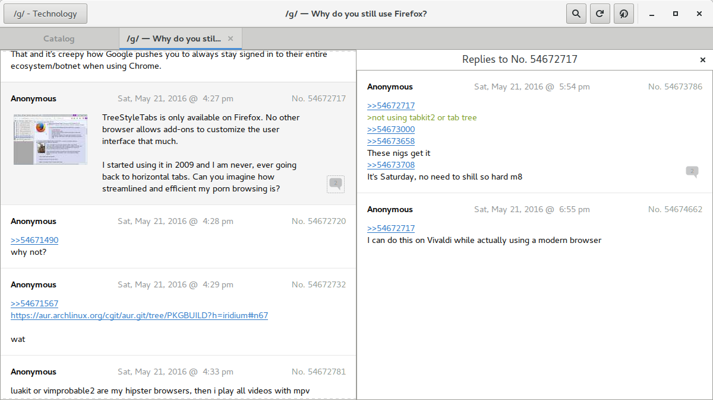

Vaccine
=======







This is an imageboard browser for Linux that is written in Vala and uses GTK.
Please contribute and report bugs.

# Dependencies
| Package name             | Version  |
|--------------------------|----------|
| glib2                    | >= 2.44  |
| vala                     |          |
| gtk3                     | >=3.18   |
| libsoup                  | >=2.4    |
| libgee                   | >=0.18   |
| gstreamer                | >=1.6    |
| gstreamer-plugins-bad    | >= 1.6   |
| json-glib                | >=1.0    |
| gtksourceview3           | >=3.16   |

Try it
---
```Bash
$ git clone --recursive https://github.com/VaccineApp/vaccine
$ ./autogen.sh
$ ./configure
$ make -j`nproc` run
```
